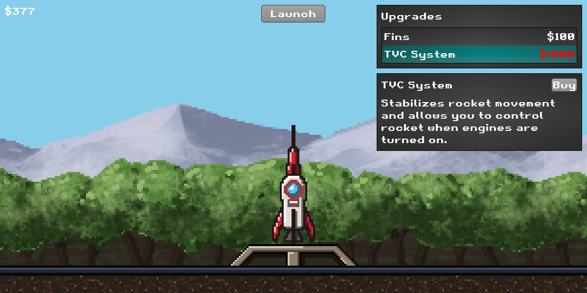
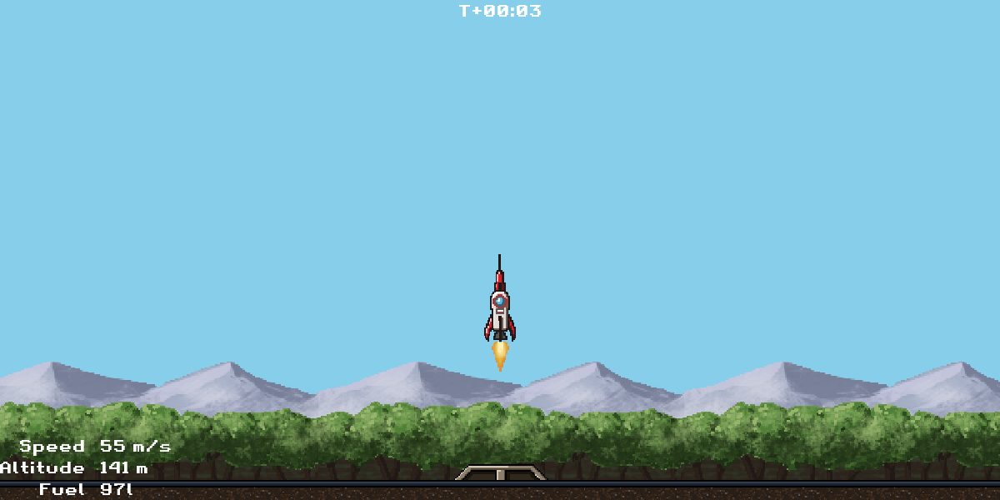

# Khors Program
Simple game written in Java using LibGDX.
## Table of contents
* [Introduction](#introduction)
* [Technologies](#technologies)
* [Screenshots](#screenshots)
## Introduction
Name of the game was inspired by [Artemis program](https://en.wikipedia.org/wiki/Artemis_program). In a Slavic mythology, Khors, similarly to Artemis, was believed to be a lunar god. The game is a simple rocket flight simulator with basic physics. It is meant to be a technical preview of ECS implementation in Java and integration with LibGDX library.
## Technologies
* **Entity-Component-System** - pattern that consists of game objects (Entities) which use composition to define their properties (Components). Entities are updated by systems. [More info](https://en.wikipedia.org/wiki/Entity_component_system)
* **LibGDX** - graphics library that provides tools for creating games for multiple platforms. [More info](https://libgdx.com/)
## Screenshots

